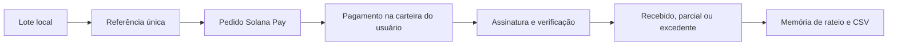

# SafraFlux

**Recebimentos em stablecoins, organizados por lote agrícola.**

Uma cooperativa vende um lote formado pela produção de várias famílias. O comprador paga em parcelas; os valores chegam a uma ou mais carteiras. O financeiro ainda precisa identificar a venda, conferir o que falta e explicar quanto cabe a cada produtor, inclusive o prêmio de qualidade.

SafraFlux organiza essa etapa: reúne carteiras, cria cobranças identificadas na Solana, verifica recebimentos e calcula a memória do rateio. O recorte inicial são **cooperativas e pequenas exportadoras de café especial**.

**Estágio:** protótipo funcional de pesquisa e demonstração, iniciado em 23/09/2026. Consultas de rede são reais; exemplos de rateio são opcionais e identificados. Não há cliente, entrevista, parceria, piloto comercial ou economia comprovada. O produto ainda não está homologado para operação financeira de uma organização.

[Pesquisa de mercado](docs/pesquisa-de-mercado.md) · [Hackathon e premiados](docs/hackathon-e-benchmarks.md) · [Arquitetura](docs/arquitetura.md) · [Validação](docs/validacao.md) · [Diário](docs/diario-de-desenvolvimento.md)

## 1. O que está entregue

| Recurso | Implementação e limite |
| --- | --- |
| Várias carteiras | Até 30 endereços públicos; um endereço pode ser acompanhado em redes diferentes. Conexão não é obrigatória para consulta. |
| Conexão Solana | Descoberta via Wallet Standard e autorização para obter endereço. Cada extensão ainda precisa de validação assistida. |
| Conexão EVM | Descoberta via EIP-6963 e conferência da rede selecionada na carteira. |
| Saldos reais | SOL/USDC na Solana; ETH/USDC na Base, Ethereum e Arbitrum. Horário e erro por carteira. |
| Cobrança por lote | Valor, destinatário, código de contrato, referência única e QR/URI Solana Pay. |
| Conciliação Solana | Assinatura informada pelo usuário; conferência de finalização, referência, destinatário, token e valor. Sem indexação automática. |
| Pagamentos parciais | Pendente, parcial, recebido e acima do valor; a entrada só é registrada após verificação. |
| Rateio por produtor | Base proporcional aos kg; prêmio proporcional a kg × pontos declarados; seis casas decimais e soma preservada. |
| Exportação | CSV de cobranças/rateio e JSON dos registros. Importação/restauração não implementada. |
| Pesquisa | Mercado, concorrentes, dez premiados, modelo comercial, riscos, arquitetura e plano de entrevistas. |

**Fora desta versão:** custódia, envio de dinheiro, repasse automático, câmbio/Pix, compra de cripto, swaps, bridges, crédito, tokenização de safra, comprovação de entrega, login organizacional e sincronização.

Aqui, **“juntar criptomoedas” significa reunir a visão de carteiras e recebimentos**. Os fundos continuam nos endereços de origem. Não são movidos para uma carteira única; moedas diferentes não são somadas como se tivessem o mesmo valor.

## 2. Por que esse recorte

O Brasil exportou **40,049 milhões de sacas de café**, com receita de **US$ 15,586 bilhões**, para **121 destinos** no ano civil de 2025. Isso mostra a relevância da cadeia internacional; não demonstra adoção de stablecoins ou tamanho do mercado de software. [Cecafé, 19/01/2026](https://www.cecafe.com.br/publicacoes/noticias/cecafe-exportacao-cafe-2025-20260119/).

| Alternativa investigada | Decisão |
| --- | --- |
| Tokenização e antecipação de safra | Adiada: depende de lastro, garantias, cobrança, estrutura jurídica e risco de crédito. |
| Tesouraria agro genérica | Mantida como componente; resolve visibilidade, mas diferencia pouco. |
| Conciliação por lote e demonstrativo por produtor | Escolhida: rotina delimitada e demonstrável, próxima do financeiro da cooperativa. |

O cliente provável é a organização que concentra contratos e recebimentos, não todo produtor rural. A adoção depende também de um comprador com motivo concreto para pagar em stablecoin.

### A diferença que pretendemos validar

**Lote → referência de cobrança → recebimentos verificados → memória de rateio.**

AgriDex já combina agro e blockchain. Request Finance já organiza pagamentos em cripto. A hipótese é que parcelas por lote e distribuição de preço-base/prêmio por produtor merecem uma experiência própria. Não há alegação de pioneirismo. [AgriDex](https://agridex.com/) · [Request Finance](https://www.requestfinance.com/).

A vantagem só será defensável se reduzir trabalho real, produzir informação utilizável pela contabilidade e conviver com o sistema existente. Não é necessário criar um token para testar isso.

## 3. Mercado, concorrência e negócio

A [pesquisa completa](docs/pesquisa-de-mercado.md) compara AgriDex, Agrotoken/Justoken, GrainChain, Request Finance, Huma/PayFi, Nagro, a referência histórica Agrofy e o processo banco + ERP + planilha. Oferta documentada e funcionalidade não confirmada ficam separadas.

O modelo a testar é assinatura por organização, sem venda de token ou promessa de rendimento.

| Cenário de trabalho — não previsão | Cálculo |
| --- | --- |
| Preço de referência | R$ 900/mês; comparar com R$ 300 e R$ 1.500 nas entrevistas |
| 40 organizações pagantes durante 12 meses | R$ 432 mil anualizados; as contas ainda não foram identificadas |
| 6 clientes durante 12 meses | R$ 64,8 mil anualizados; não é faturamento esperado do primeiro ano |
| Custo fixo hipotético de R$ 8 mil e contribuição de R$ 700/conta/mês | Aproximadamente 12 clientes para cobrir esse custo, antes dos demais ajustes |

O TAM específico não foi apurado. Volume exportado não é receita potencial de software; cooperados não equivalem a organizações pagantes. A pesquisa inclui fórmulas, sensibilidade e custos ainda sem cotação.

**Validação prevista:** 14 entrevistas — quatro financeiros, três produtores, três compradores, dois contadores e dois profissionais de pagamentos/jurídico. Nenhuma realizada. Buscar três organizações com dor documentada, dez recebimentos anonimizados e dois interessados em piloto. Reduzir em 50% o tempo de conferência é uma meta proposta, não resultado.

## 4. Hackathon e redes

A edição indicada é o **Crypto World's Fair, da Colosseum**, com apoio da Superteam Brasil. O regulamento consultado prevê encerramento em **12/10/2026, 23:59 PT**, equivalente a **13/10/2026, 03:59 em Brasília**. A submissão global deve estar em inglês. [Regulamento](https://colosseum.com/legal/Crypto%20World%27s%20Fair%20Hackathon%20Rules.pdf).

As oito trilhas são Solana, Tempo, Hyperliquid, Zcash, Ethereum L1, Base, Arbitrum e Robinhood Chain. Solana é a trilha principal proposta e integração necessária para a Trilha Brasil/acelerador. Não se presume acumular premiações de várias redes. [Colosseum](https://colosseum.com/worldsfair) · [Superteam Brasil](https://hackathon.superteam.com.br/).

| Rede | Saldos | Cobrança/conciliação | Evidência atual |
| --- | --- | --- | --- |
| Solana Mainnet | SOL, USDC | USDC com referência Solana Pay | Consulta real verificada |
| Solana Devnet | SOL/USDC de teste | USDC de teste | Consulta verificada; padrão dos formulários; sem valor financeiro |
| Base | ETH, USDC nativo | Não | Consulta real verificada |
| Ethereum | ETH, USDC nativo | Não | Consulta real verificada |
| Arbitrum | ETH, USDC nativo | Não | Consulta real verificada |
| Tempo, Hyperliquid, Zcash, Robinhood Chain | Não | Não | Trilhas do evento, sem integração nesta versão |

Solana é uma blockchain; Phantom, Solflare e outros aplicativos são carteiras. O suporte é ao padrão de conexão, não uma certificação individual. Conexão com extensão real e pagamento completo permanecem pendentes de validação assistida.

Contratos USDC vêm da [lista oficial da Circle](https://developers.circle.com/stablecoins/usdc-contract-addresses). Ambientes e ativos ficam separados. A soma de USDC é quantidade de tokens consultados; não é saldo bancário nem garantia de resgate/conversão.

## 5. Aprendizados de projetos premiados

| Projeto | Resultado oficial | Aplicação ao SafraFlux |
| --- | --- | --- |
| CargoBill | 1º Stablecoins, Breakout 2025 | Demonstrar o contexto comercial do pagamento na cadeia produtiva. |
| Home Harvest | 3º DePIN, Breakout 2025 | Já há precedente agrícola; agro + blockchain sozinho não é novidade. |
| GLAM | 2º DeFi & Payments, Renaissance 2024 | Organização financeira pede controles compreensíveis. |
| Autonom | 1º RWA, Cypherpunk 2025 | Registro on-chain não certifica mercadoria ou dado externo. |
| Cloak | 3º Stablecoin, Cypherpunk 2025 | Contratos e relações comerciais exigem privacidade. |

Fontes: [Breakout](https://blog.colosseum.com/announcing-the-winners-of-the-solana-breakout-hackathon/), [Renaissance](https://blog.colosseum.com/announcing-the-winners-of-the-solana-renaissance-hackathon/), [Cypherpunk](https://blog.colosseum.com/announcing-the-winners-of-the-solana-cypherpunk-hackathon/). O [estudo](docs/hackathon-e-benchmarks.md) registra dez projetos, incluindo o Top 25 do Frontier sem inventar posições internas. Premiação, aceleração e captação são acontecimentos diferentes.

## 6. Executar e experimentar

Requisitos: **Node.js 24 LTS**, npm e navegador atualizado. O rateio pode ser testado sem possuir cripto.

```bash
git clone https://github.com/SouBeatrizKaroline/safraflux.git
cd safraflux
npm ci
npm run dev
```

Abra o endereço indicado, normalmente `http://127.0.0.1:4173/`.

1. Em **Rateio por produtor**, escolha **Preencher exemplo fictício** e calcule.
2. Em **Carteiras**, adicione um endereço público e a rede. A conexão é facultativa e depende da extensão instalada no navegador.
3. Em **Lotes e cobranças**, informe lote, valor, rede e destinatário. Use Devnet para avaliação. Criar o QR não transfere fundos.
4. Depois de um pagamento realizado pelo usuário, informe a assinatura. Somente transações aceitas pelo verificador alteram o recebido.
5. No rateio, selecione a cobrança para usar seu valor recebido ou informe um valor manual, identificado como não comprovado.
6. Exporte CSV/JSON. Registros ficam apenas nesse navegador/origem.

**Solana Pay não seleciona o cluster no URI.** O pagador precisa escolher a rede na carteira e conferir mint, valor e destinatário. Tokens Devnet não têm valor financeiro.

Provedores públicos podem limitar consultas. Em **Configurações**, defina RPC HTTPS de confiança. Erros não são substituídos por saldo fictício. Não exponha segredos de servidor em URLs usadas pelo navegador.

## 7. Conciliação e rateio



O verificador confere rede, status `finalized`, sucesso, assinatura, data, mint e destinatário. A referência deve estar na própria instrução SPL como conta não assinante/somente leitura. O destino deve ser a conta associada de USDC e o crédito líquido deve corresponder à transferência identificada.

A mesma assinatura não é aceita novamente na mesma rede dentro do estado local. Swaps, instruções internas e movimentos adicionais no destino são rejeitados. Não há botão para marcar artificialmente uma cobrança como paga. A verificação **não comprova identidade jurídica, qualidade, origem, certificação, entrega física ou quitação jurídica do contrato**.

### Regra do rateio

- **Base:** total menos pool do prêmio, proporcional aos kg.
- **Prêmio:** proporcional a kg × pontos declarados (0–100).
- **Arredondamento:** maiores restos; desempate pela ordem informada. Soma exata até 0,000001 USDC.

Os pontos devem ter significado definido no contrato; não são nota SCA atribuída automaticamente. Exemplo fictício: 1.000 USDC, 10% de prêmio, produtor A com 600 kg/80 pontos e B com 400 kg/90 pontos. A recebe atribuição calculada de **597,142857** e B de **402,857143 USDC**. A soma é 1.000. Não houve transferência ou cliente real nesse exemplo.

Despesas, descontos, tributos e regras contratuais diferentes não são processados. Cálculo não significa repasse executado.

## 8. Arquitetura e limites

Aplicação estática em JavaScript/Vite, com Solana Kit (`@solana/addresses`), Wallet Standard, `bs58` e QR. O núcleo monetário usa `BigInt`. Não há contrato inteligente próprio; são usados os programas de tokens existentes.

```text
src/domain.js     valores, rateio e validação de transferência
src/chains.js     redes, RPC, endereços e conexão
src/main.js       interface, registros locais e exportação
tests/           casos positivos e negativos
docs/            pesquisa, decisões, validação e diário
```

O estado em `localStorage` pode ser alterado por quem controla o dispositivo. Não há histórico inviolável, recuperação automática, autenticação ou coordenação entre abas. Um piloto organizacional exige backend e unicidade transacional. Use uma aba por conjunto de registros. Consulte [arquitetura](docs/arquitetura.md) e [segurança](SECURITY.md).

A aplicação não pede seed, armazena chave privada ou assina transferências. A consulta depende de um RPC confiável; não é prova criptográfica independente. Códigos de lote/contrato não devem conter dados pessoais ou segredos comerciais.

## 9. Testes e evidências

```bash
npm test
npm run build
node scripts/check-rpc.js
```

Os testes cobrem precisão, conservação do total, prêmio, pagamento parcial/excedente, duplicação, referência alheia, rede/token/destinatário errados, transação falha/antiga/pendente e CSV.

Consultas reais somente leitura responderam nos cinco ambientes configurados. Os testes de conciliação usam fixtures sintéticas e **não representam um pagamento efetuado pelo projeto**. A interface foi inspecionada no navegador; veja [validação](docs/validacao.md). O workflow no GitHub executa testes, build e auditoria a cada envio.

## 10. Próximas entregas

1. Validar a dor e a demanda por stablecoins com organizações e compradores.
2. Demonstrar pagamento completo em Devnet com carteiras reais, parcelas e rejeições.
3. Implementar backend, papéis, histórico, backups, restauração e uso concorrente.
4. Versionar regras de rateio, vincular documentos privados do prêmio e obter revisão contábil.
5. Revisar enquadramento jurídico/fiscal/cambial com os prestadores envolvidos.
6. Ampliar redes ou automatizar pagamentos somente com demanda e controles definidos.

As Resoluções BCB 519, 520 e 521 estabelecem regras relevantes para ativos virtuais e operações internacionais. Autocustódia não equivale a dispensa regulatória; importa a atividade efetiva. [BCB](https://www.bcb.gov.br/detalhenoticia/20918/nota?s=08). A pesquisa delimita o tema sem emitir parecer jurídico.

## 11. Histórico, contribuição e licença

O desenvolvimento próprio começou em **23/09/2026**, durante o período anunciado do hackathon. Não foi reaproveitado código de outro projeto da proponente. Bibliotecas de terceiros estão no manifesto/lockfile. Commits intermediários podem registrar etapas incompletas.

Envios foram programados em intervalos aproximados de dois minutos durante o trabalho ativo. A retomada após interrupção reiniciou a rotina. Não há publicação periódica indefinida após esta entrega. O [diário](docs/diario-de-desenvolvimento.md) descreve decisões e verificações.

Nenhuma candidatura foi submetida. O [resumo em inglês](docs/project-brief-en.md) prepara a inscrição e deve ser revisto contra o formulário oficial. SafraFlux é um nome de trabalho; disponibilidade de marca não investigada.

Código aberto sob [MIT](LICENSE). Contribuições: [CONTRIBUTING.md](CONTRIBUTING.md). Referências externas continuam pertencendo aos respectivos titulares.
